# 🔍 RealtimeVoiceChat 系统业务流程详细分析

## 📋 目录
1. [UI界面操作流程](#ui界面操作流程)
2. [WebSocket API详细分析](#websocket-api详细分析)
3. [后端业务逻辑分支](#后端业务逻辑分支)
4. [音频处理管道](#音频处理管道)
5. [状态管理机制](#状态管理机制)
6. [错误处理流程](#错误处理流程)

---

## 🖥️ UI界面操作流程

### 界面组件分析

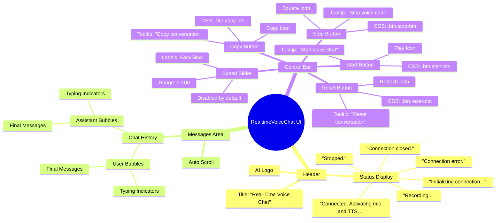

### 按钮操作详细逻辑

#### 1. **Start Button** (`#startBtn`)
```javascript
// 触发条件：用户点击开始按钮
document.getElementById("startBtn").onclick = async () => {
  // 检查WebSocket连接状态
  if (socket && socket.readyState === WebSocket.OPEN) {
    statusDiv.textContent = "Already recording.";
    return; // 早期返回，防止重复连接
  }
  
  // 状态更新
  statusDiv.textContent = "Initializing connection...";
  
  // WebSocket连接建立
  const wsProto = window.location.protocol === 'https:' ? 'wss:' : 'ws:';
  socket = new WebSocket(`${wsProto}//${location.host}/ws`);
  
  // 连接成功处理
  socket.onopen = async () => {
    statusDiv.textContent = "Connected. Activating mic and TTS…";
    await startRawPcmCapture();    // 启动麦克风捕获
    await setupTTSPlayback();      // 设置TTS播放
    speedSlider.disabled = false;  // 启用速度控制
  };
  
  // 消息处理
  socket.onmessage = (evt) => {
    if (typeof evt.data === "string") {
      try {
        const msg = JSON.parse(evt.data);
        handleJSONMessage(msg);
      } catch (e) {
        console.error("Error parsing message:", e);
      }
    }
  };
  
  // 连接关闭处理
  socket.onclose = () => {
    statusDiv.textContent = "Connection closed.";
    flushRemainder();              // 清空音频缓冲
    cleanupAudio();               // 清理音频资源
    speedSlider.disabled = true;  // 禁用速度控制
  };
  
  // 错误处理
  socket.onerror = (err) => {
    statusDiv.textContent = "Connection error.";
    cleanupAudio();
    console.error(err);
    speedSlider.disabled = true;
  };
};
```

#### 2. **Stop Button** (`#stopBtn`)
```javascript
// 触发条件：用户点击停止按钮
document.getElementById("stopBtn").onclick = () => {
  // WebSocket连接处理
  if (socket && socket.readyState === WebSocket.OPEN) {
    flushRemainder();  // 发送剩余音频数据
    socket.close();    // 关闭WebSocket连接
  }
  
  // 资源清理
  cleanupAudio();      // 清理所有音频资源
  statusDiv.textContent = "Stopped.";  // 更新状态显示
};
```

#### 3. **Reset Button** (`#clearBtn`)
```javascript
// 触发条件：用户点击重置按钮
document.getElementById("clearBtn").onclick = () => {
  // 本地状态清理
  chatHistory = [];                    // 清空聊天历史
  typingUser = typingAssistant = "";   // 清空输入状态
  renderMessages();                    // 重新渲染消息
  
  // 服务器状态清理
  if (socket && socket.readyState === WebSocket.OPEN) {
    socket.send(JSON.stringify({ type: 'clear_history' }));
  }
};
```

#### 4. **Copy Button** (`#copyBtn`)
```javascript
// 触发条件：用户点击复制按钮
document.getElementById("copyBtn").onclick = () => {
  // 格式化聊天历史
  const text = chatHistory
    .map(msg => `${msg.role.charAt(0).toUpperCase() + msg.role.slice(1)}: ${msg.content}`)
    .join('\n');
  
  // 复制到剪贴板
  navigator.clipboard.writeText(text)
    .then(() => console.log("Conversation copied to clipboard"))
    .catch(err => console.error("Copy failed:", err));
};
```

#### 5. **Speed Slider** (`#speedSlider`)
```javascript
// 触发条件：用户拖动速度滑块
speedSlider.addEventListener("input", (e) => {
  const speedValue = parseInt(e.target.value);  // 获取滑块值 (0-100)
  
  // 发送速度设置到服务器
  if (socket && socket.readyState === WebSocket.OPEN) {
    socket.send(JSON.stringify({
      type: 'set_speed',
      speed: speedValue
    }));
  }
  console.log("Speed setting changed to:", speedValue);
});
```

---

## 🔌 WebSocket API详细分析

### 客户端到服务器消息类型

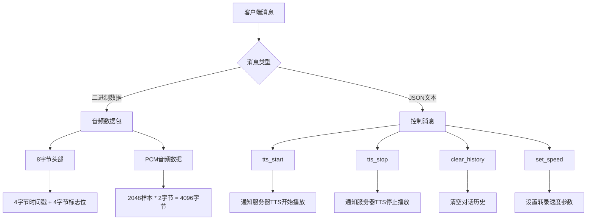

### 服务器到客户端消息类型

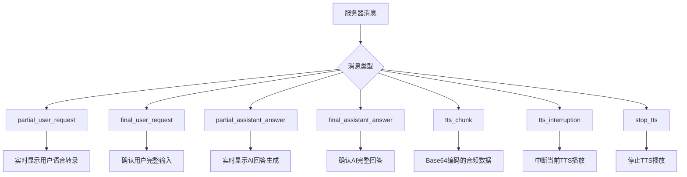

### 音频数据包格式详解

```
音频数据包结构 (总计4104字节):
┌─────────────────┬─────────────────┬─────────────────────────────┐
│   时间戳 (4B)   │   标志位 (4B)   │      PCM音频数据 (4096B)    │
│  Big-Endian     │  Big-Endian     │     2048 samples * 2 bytes  │
│   uint32        │   uint32        │        Int16 Array          │
└─────────────────┴─────────────────┴─────────────────────────────┘

标志位定义:
- Bit 0: isTTSPlaying (1=播放中, 0=未播放)
- Bit 1-31: 保留位
```

---

## 🔄 后端业务逻辑分支

### WebSocket连接处理流程

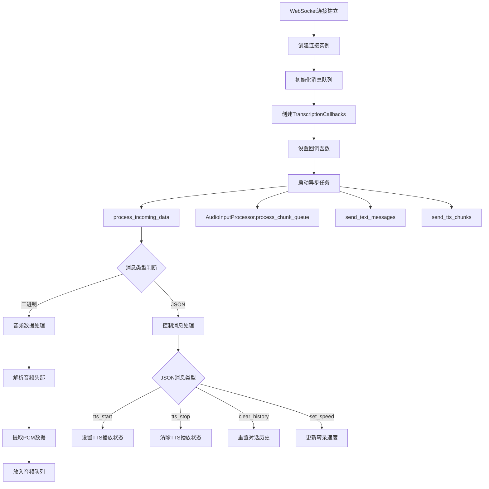

### 音频处理管道详细流程

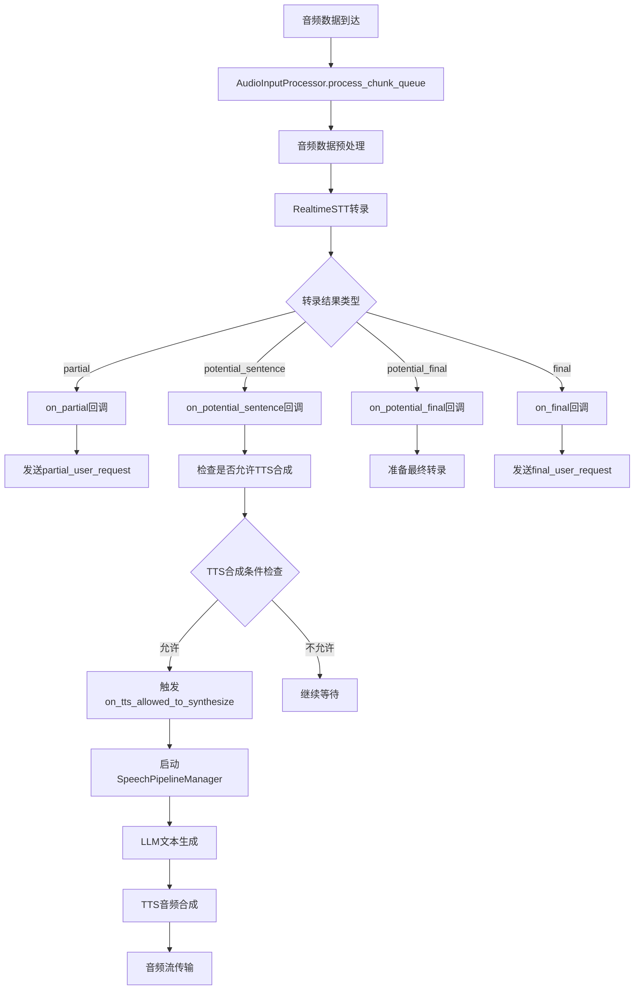

### SpeechPipelineManager状态机

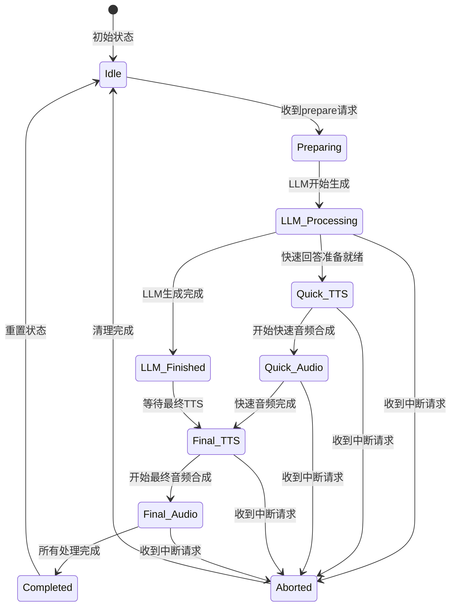

### TTS引擎选择逻辑

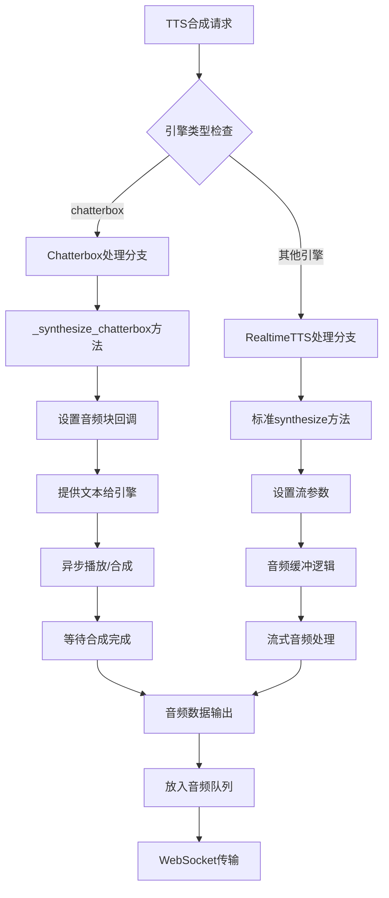

---

## 🎵 音频处理管道

### 客户端音频捕获流程

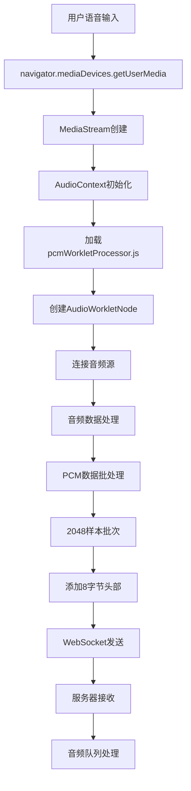

### 服务器端音频处理流程

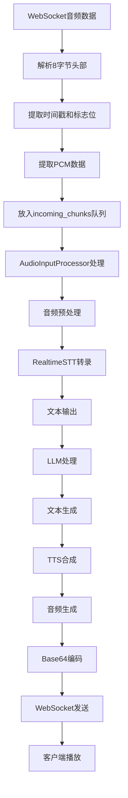

### TTS音频播放流程

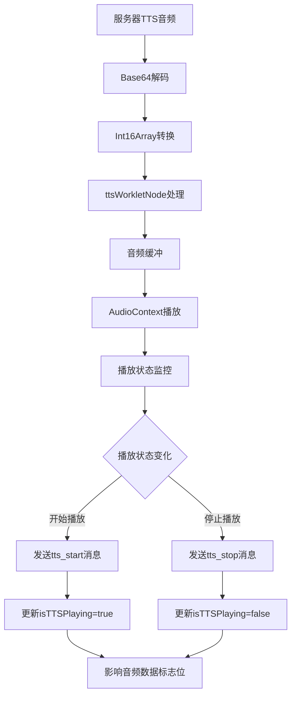

---

## 📊 状态管理机制

### 全局状态管理

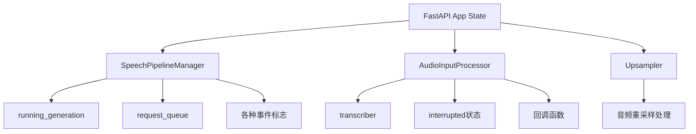

### 连接级状态管理

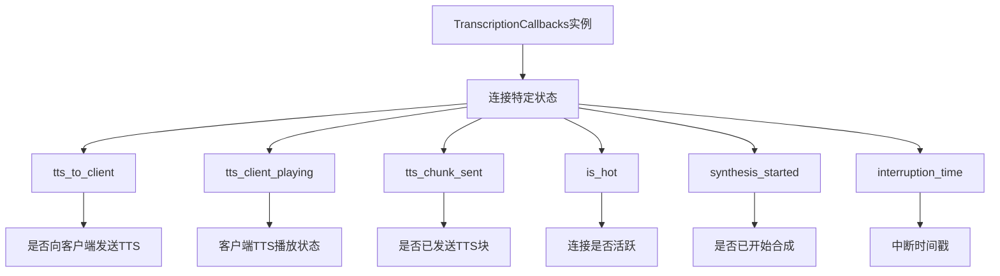

### 生成状态管理

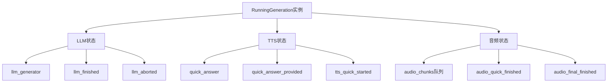

---

## ⚠️ 错误处理流程

### WebSocket连接错误

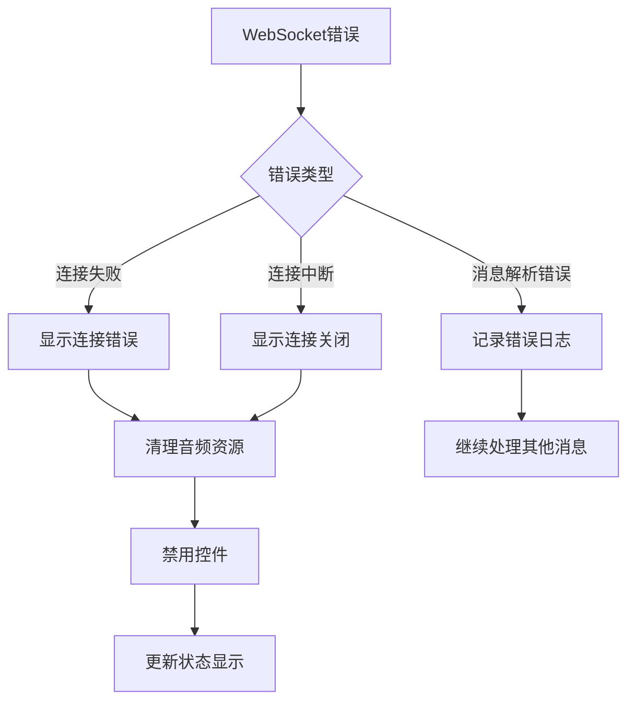

### 音频处理错误

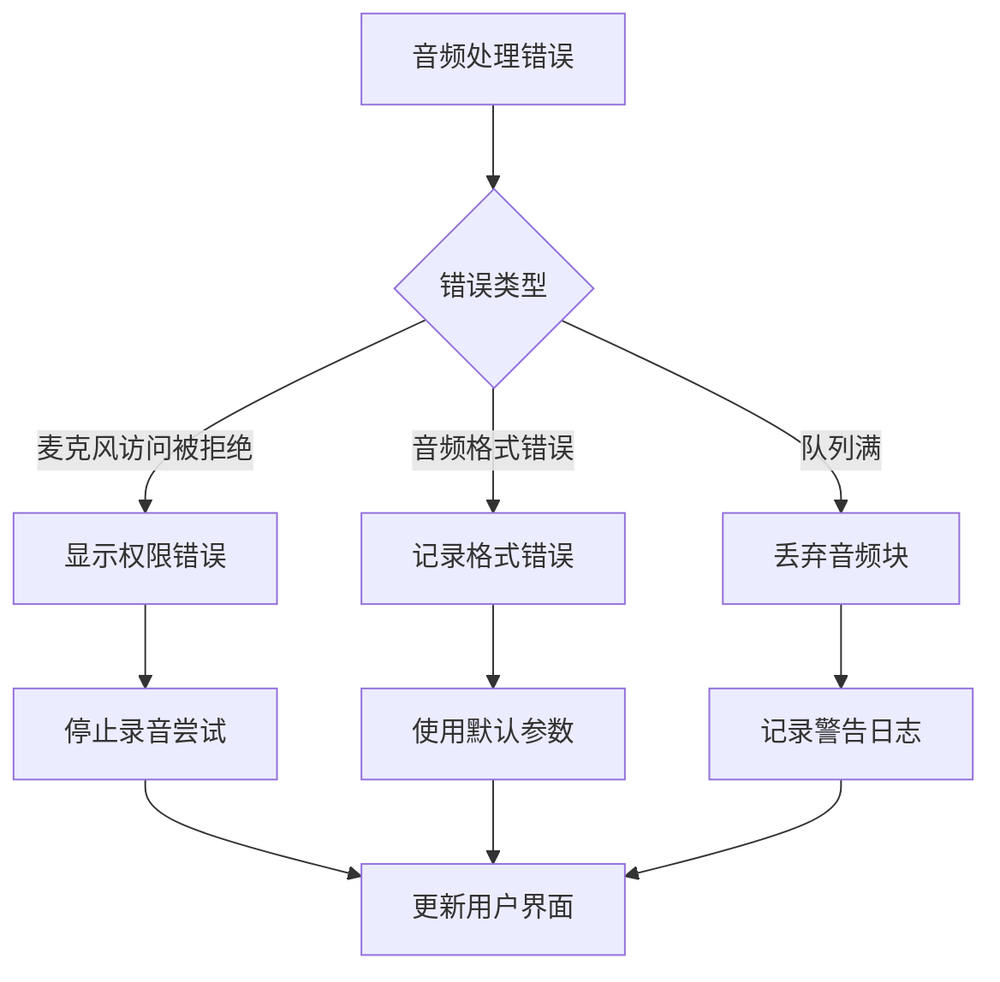

### TTS合成错误

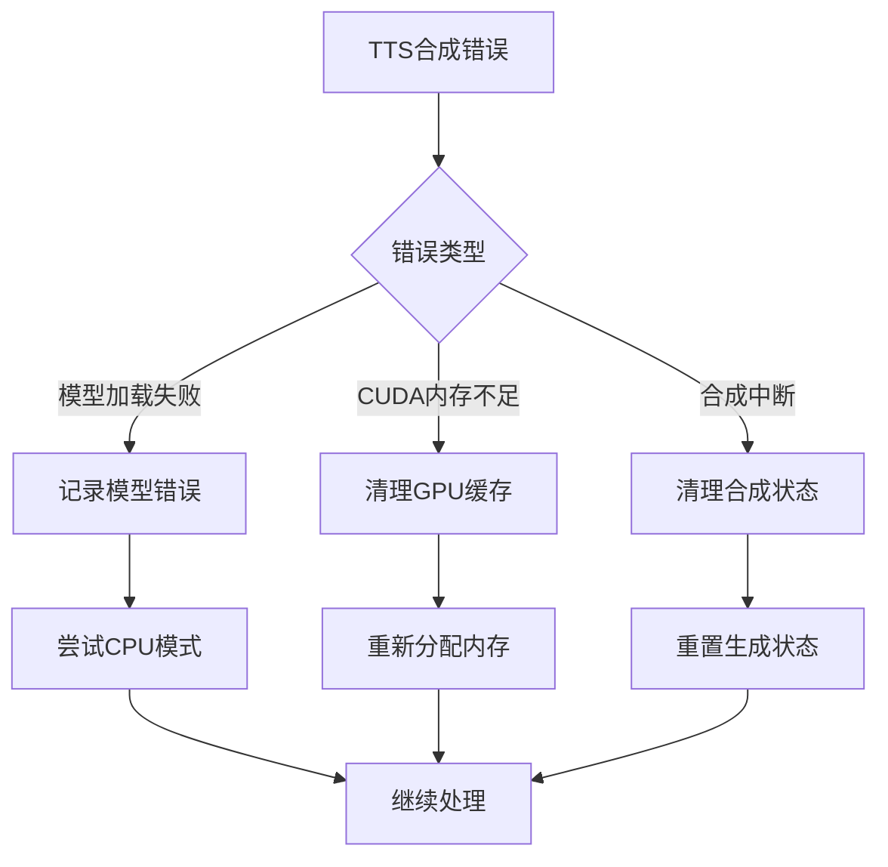

---

## 🔄 完整业务流程图

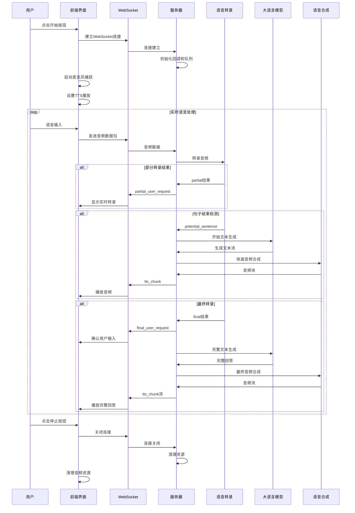

---

## 📋 API接口总结

### WebSocket消息协议

#### 客户端 → 服务器

| 消息类型 | 格式 | 描述 | 参数 |
|---------|------|------|------|
| 音频数据 | Binary | PCM音频流 | 8字节头部 + 4096字节音频 |
| tts_start | JSON | TTS播放开始 | `{"type": "tts_start"}` |
| tts_stop | JSON | TTS播放停止 | `{"type": "tts_stop"}` |
| clear_history | JSON | 清空对话历史 | `{"type": "clear_history"}` |
| set_speed | JSON | 设置转录速度 | `{"type": "set_speed", "speed": 0-100}` |

#### 服务器 → 客户端

| 消息类型 | 格式 | 描述 | 参数 |
|---------|------|------|------|
| partial_user_request | JSON | 实时转录结果 | `{"type": "partial_user_request", "content": "text"}` |
| final_user_request | JSON | 最终转录结果 | `{"type": "final_user_request", "content": "text"}` |
| partial_assistant_answer | JSON | AI回答生成中 | `{"type": "partial_assistant_answer", "content": "text"}` |
| final_assistant_answer | JSON | AI最终回答 | `{"type": "final_assistant_answer", "content": "text"}` |
| tts_chunk | JSON | TTS音频块 | `{"type": "tts_chunk", "content": "base64_audio"}` |
| tts_interruption | JSON | TTS中断信号 | `{"type": "tts_interruption"}` |
| stop_tts | JSON | 停止TTS播放 | `{"type": "stop_tts"}` |

### HTTP接口

| 路径 | 方法 | 描述 |
|------|------|------|
| `/` | GET | 主页面 |
| `/favicon.ico` | GET | 网站图标 |
| `/static/*` | GET | 静态资源 |
| `/ws` | WebSocket | 主要通信接口 |

---

**文档版本**: v1.0  
**最后更新**: 2025年6月3日  
**状态**: 详细分析完成