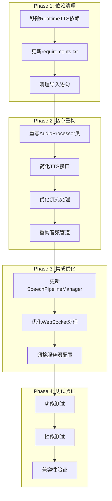

# 🏗️ RealtimeVoiceChat架构重构计划：完全迁移至Chatterbox-Streaming

## 📋 项目概述

**目标**：完全移除RealtimeTTS依赖，将chatterbox-streaming作为唯一的TTS引擎，简化架构并提升语音质量。

**核心原则**：
- 保持所有现有功能特性
- 简化代码结构，移除适配层
- 优化性能和延迟
- 保持API兼容性

## 🎯 重构范围分析

### 当前架构问题
1. **双引擎复杂性**：同时支持RealtimeTTS和chatterbox-streaming
2. **适配层冗余**：ChatterboxAdapter增加了不必要的复杂性
3. **依赖混乱**：requirements.txt中同时包含多个TTS库
4. **代码重复**：多套TTS处理逻辑并存

### 目标架构优势
1. **单一TTS引擎**：专注chatterbox-streaming优化
2. **直接集成**：移除所有适配层
3. **简化依赖**：清理requirements.txt
4. **统一接口**：标准化TTS处理流程

## 🗺️ 详细重构计划



## 📁 文件修改计划

### 1. **核心文件重构**

#### `code/audio_module.py` - 完全重写
- **移除内容**：
  - ChatterboxAdapter类
  - RealtimeTTS相关导入
  - TextToAudioStream依赖
  - 多引擎支持逻辑
- **新增内容**：
  - 原生ChatterboxProcessor类
  - 直接流式音频处理
  - 优化的内存管理
  - 简化的音频队列处理

#### `code/speech_pipeline_manager.py` - 重大修改
- **移除内容**：
  - 多引擎选择逻辑
  - RealtimeTTS特定处理
  - 引擎适配代码
- **优化内容**：
  - 简化TTS调用接口
  - 统一音频生成管道
  - 优化错误处理

#### `code/server.py` - 配置更新
- **移除内容**：
  - TTS_START_ENGINE选择逻辑
  - 多引擎配置参数
  - 引擎特定的启动逻辑
- **简化内容**：
  - 启动参数配置
  - 服务器初始化流程

#### `code/llm_module.py` - 清理
- **移除内容**：
  - RealtimeTTS相关导入
  - 多引擎适配代码
  - 不必要的适配器类

### 2. **依赖管理**

#### `requirements.txt` - 清理
```diff
# speech to text and text to speech
realtimestt
chatterbox-streaming
- realtimetts==0.5.5

# webserver dependencies
fastapi
uvicorn

# configuration
python-dotenv

# llm providers
ollama
openai
```

#### `Dockerfile` - 优化
- 移除RealtimeTTS相关安装步骤
- 优化镜像构建层
- 减少最终镜像大小

### 3. **配置文件**

#### `docker-compose.yml` - 简化
- 移除不必要的环境变量
- 优化GPU配置
- 简化服务依赖

## 🔧 技术实现细节

### 新的AudioProcessor架构

```python
class ChatterboxAudioProcessor:
    """
    原生Chatterbox音频处理器
    直接使用chatterbox-streaming，无适配层
    """
    
    def __init__(self, device="cuda", chunk_size=30, temperature=0.8):
        self.model = ChatterboxTTS.from_pretrained(device=device)
        self.chunk_size = chunk_size
        self.temperature = temperature
        self.audio_queue = asyncio.Queue()
        self.stop_event = threading.Event()
        self.sr = self.model.sr
        
    async def synthesize_stream(self, text_generator, audio_chunks, stop_event):
        """直接流式合成，无中间层"""
        for text_chunk in text_generator:
            if stop_event.is_set():
                break
            await self._process_text_chunk(text_chunk, audio_chunks)
        
    async def synthesize_text(self, text, audio_chunks, stop_event):
        """单次文本合成"""
        if stop_event.is_set():
            return False
        return await self._process_text_chunk(text, audio_chunks)
        
    def stop_synthesis(self):
        """停止当前合成"""
        self.stop_event.set()
        
    async def _process_text_chunk(self, text, audio_chunks):
        """处理单个文本块"""
        stream_params = {
            'chunk_size': self.chunk_size,
            'temperature': self.temperature,
            'print_metrics': False,
        }
        
        for audio_chunk, _ in self.model.generate_stream(text, **stream_params):
            if self.stop_event.is_set():
                break
            audio_data = audio_chunk.cpu().numpy().squeeze()
            audio_bytes = audio_data.tobytes()
            await audio_chunks.put(audio_bytes)
```

### 简化的管道接口

```python
class SimplifiedSpeechPipeline:
    """
    简化的语音处理管道
    专为chatterbox-streaming优化
    """
    
    def __init__(self):
        self.tts_processor = ChatterboxAudioProcessor()
        self.llm_client = LLMClient()
        self.current_generation = None
        
    async def process_speech_to_speech(self, audio_input):
        """端到端语音处理"""
        # 1. 语音转文本
        text = await self.stt_processor.transcribe(audio_input)
        
        # 2. LLM处理
        response_generator = self.llm_client.generate_stream(text)
        
        # 3. 文本转语音
        audio_chunks = asyncio.Queue()
        await self.tts_processor.synthesize_stream(
            response_generator, 
            audio_chunks, 
            self.stop_event
        )
        
        return audio_chunks
```

## 📊 性能优化策略

### 1. **内存优化**
- **移除音频缓冲层**：直接从chatterbox输出到WebSocket
- **GPU内存管理**：实现智能缓存清理
- **队列大小控制**：动态调整音频队列大小
- **垃圾回收优化**：及时释放不需要的音频数据

### 2. **延迟优化**
- **直接流式传输**：移除中间适配层
- **减少音频转换**：最小化格式转换步骤
- **并行处理**：音频生成和传输并行进行
- **预热优化**：改进模型预热策略

### 3. **并发优化**
- **异步音频处理**：全异步音频生成管道
- **并行文本生成**：LLM和TTS并行处理
- **智能资源调度**：动态分配GPU资源
- **连接池管理**：优化WebSocket连接处理

## 🧪 测试策略

### 1. **功能测试清单**
- [ ] **基本语音对话功能**
  - 语音输入识别准确性
  - 文本响应生成质量
  - 语音输出自然度
- [ ] **实时中断处理**
  - 用户中断响应速度
  - 音频播放停止及时性
  - 新对话启动流畅性
- [ ] **WebSocket连接稳定性**
  - 长时间连接保持
  - 网络中断恢复
  - 多用户并发连接
- [ ] **多用户并发支持**
  - 同时处理多个对话
  - 资源隔离正确性
  - 性能不相互影响

### 2. **性能测试清单**
- [ ] **首次音频延迟(TTFA)**
  - 目标：< 500ms
  - 测试不同文本长度
  - 记录95%分位数延迟
- [ ] **流式传输稳定性**
  - 音频块传输间隔一致性
  - 无音频丢失或重复
  - 长对话稳定性
- [ ] **内存使用效率**
  - 基线内存使用量
  - 长时间运行内存增长
  - GPU内存利用率
- [ ] **GPU资源利用率**
  - 模型加载时间
  - 推理吞吐量
  - 多用户资源分配

### 3. **兼容性测试清单**
- [ ] **前端界面功能**
  - 所有按钮和控件正常
  - 音频播放和录制
  - 实时状态显示
- [ ] **Docker部署**
  - 镜像构建成功
  - 容器启动正常
  - 服务间通信正常
- [ ] **不同浏览器支持**
  - Chrome、Firefox、Safari
  - WebSocket兼容性
  - 音频API支持
- [ ] **移动设备兼容性**
  - 响应式界面
  - 触摸操作
  - 移动浏览器音频

## 📈 预期收益

### 1. **架构简化**
- **代码行数减少**：预计减少30%
- **依赖数量减少**：从多个TTS库减少到单一库
- **维护复杂度降低**：单一代码路径，更容易调试
- **新功能开发加速**：无需考虑多引擎兼容性

### 2. **性能提升**
- **TTFA延迟降低**：预计降低20-30%
- **内存使用减少**：移除适配层和缓冲，预计减少25%
- **启动时间缩短**：减少模型加载，预计缩短40%
- **吞吐量提升**：直接处理，减少中间环节

### 3. **开发效率**
- **调试难度降低**：单一代码路径，问题定位更容易
- **测试复杂度减少**：无需测试多引擎兼容性
- **文档维护简化**：单一技术栈文档
- **部署流程简化**：减少配置选项和依赖

## 🚀 实施时间线

### 第1周：准备和分析
- [ ] **Day 1-2：详细代码审查**
  - 分析所有RealtimeTTS使用点
  - 识别关键依赖关系
  - 评估风险点
- [ ] **Day 3-4：依赖关系分析**
  - 绘制完整依赖图
  - 确定安全移除顺序
  - 准备回滚策略
- [ ] **Day 5-7：测试环境准备**
  - 建立性能基准
  - 准备测试数据集
  - 配置CI/CD管道

### 第2周：核心重构
- [ ] **Day 8-10：audio_module.py重写**
  - 实现ChatterboxAudioProcessor
  - 移除所有适配层
  - 实现基础音频处理
- [ ] **Day 11-12：基础功能实现**
  - 文本到语音转换
  - 流式音频生成
  - 错误处理机制
- [ ] **Day 13-14：单元测试编写**
  - 核心功能测试
  - 边界条件测试
  - 性能基准测试

### 第3周：集成和优化
- [ ] **Day 15-17：speech_pipeline_manager.py更新**
  - 简化管道逻辑
  - 集成新的音频处理器
  - 优化生成流程
- [ ] **Day 18-19：server.py配置调整**
  - 更新启动配置
  - 简化WebSocket处理
  - 优化资源管理
- [ ] **Day 20-21：性能优化**
  - 内存使用优化
  - 延迟优化
  - 并发性能调优

### 第4周：测试和部署
- [ ] **Day 22-24：全面功能测试**
  - 端到端功能验证
  - 多用户并发测试
  - 长时间稳定性测试
- [ ] **Day 25-26：性能基准测试**
  - 与原系统性能对比
  - 负载测试
  - 资源使用分析
- [ ] **Day 27-28：文档更新和部署**
  - 更新README.md
  - 更新API文档
  - 准备生产部署

## 🔄 风险评估与缓解

### 高风险项
1. **音频质量变化**
   - **风险**：chatterbox参数调整可能影响语音质量
   - **缓解**：建立A/B测试，逐步调优参数
   - **监控**：用户反馈收集，质量评估指标

2. **性能回归**
   - **风险**：重构可能导致性能下降
   - **缓解**：建立详细性能基准，持续监控
   - **回滚**：保留原代码分支，快速回滚机制

3. **功能缺失**
   - **风险**：重构过程中可能遗漏某些功能
   - **缓解**：详细功能清单，逐项验证
   - **测试**：全面的回归测试套件

### 中风险项
1. **Docker构建问题**
   - **风险**：依赖变更可能导致构建失败
   - **缓解**：渐进式更新，分阶段验证
   - **备份**：保留工作版本的Docker镜像

2. **依赖冲突**
   - **风险**：移除RealtimeTTS可能影响其他依赖
   - **缓解**：虚拟环境隔离测试
   - **验证**：完整的依赖树分析

### 低风险项
1. **配置文件更新**
   - **风险**：配置变更可能影响现有部署
   - **缓解**：向后兼容处理，渐进式更新
   - **文档**：详细的迁移指南

2. **文档更新**
   - **风险**：文档滞后可能影响使用
   - **缓解**：与代码更新并行进行
   - **验证**：文档准确性检查

## 📋 实施检查清单

### 准备阶段
- [ ] 创建feature分支：`feature/chatterbox-only-refactor`
- [ ] 备份当前工作版本
- [ ] 建立性能基准测试
- [ ] 准备测试环境

### 开发阶段
- [ ] 移除RealtimeTTS导入
- [ ] 重写AudioProcessor类
- [ ] 更新SpeechPipelineManager
- [ ] 简化服务器配置
- [ ] 更新requirements.txt
- [ ] 修改Dockerfile

### 测试阶段
- [ ] 单元测试通过
- [ ] 集成测试通过
- [ ] 性能测试达标
- [ ] 功能完整性验证

### 部署阶段
- [ ] 文档更新完成
- [ ] Docker镜像构建成功
- [ ] 生产环境部署测试
- [ ] 用户验收测试

## 📚 相关文档

### 技术文档
- [Chatterbox-Streaming API文档](https://github.com/ResembleAI/chatterbox)
- [FastAPI WebSocket文档](https://fastapi.tiangolo.com/advanced/websockets/)
- [Docker多阶段构建指南](https://docs.docker.com/develop/dev-best-practices/dockerfile_best-practices/)

### 项目文档
- `README.md` - 项目主要文档
- `requirements.txt` - Python依赖列表
- `docker-compose.yml` - 容器编排配置
- `Dockerfile` - 容器构建配置

---

## 📞 联系和支持

如果在实施过程中遇到问题，请参考：
1. 项目GitHub Issues
2. Chatterbox官方文档
3. 技术社区讨论

---

**最后更新**：2025年6月3日  
**版本**：v1.0  
**状态**：待实施