# 🧪 RealtimeVoiceChat 测试用例设计

## 📋 目录
1. [用户场景测试用例](#用户场景测试用例)
2. [功能模块测试用例](#功能模块测试用例)
3. [异常场景测试用例](#异常场景测试用例)
4. [性能测试用例](#性能测试用例)
5. [兼容性测试用例](#兼容性测试用例)

---

## 🎭 用户场景测试用例

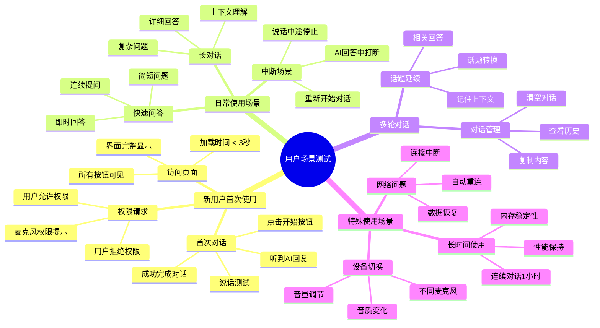

### 详细用户场景测试用例

#### 场景1：新用户首次体验
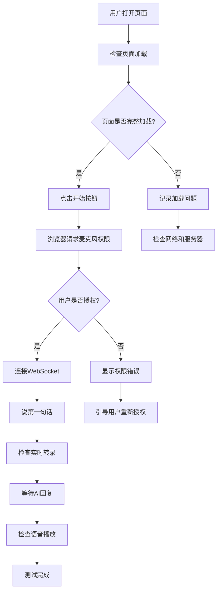

**测试步骤**：
1. 打开浏览器，访问应用URL
2. 验证页面在3秒内完全加载
3. 检查所有UI元素正确显示
4. 点击"开始"按钮
5. 在权限提示中选择"允许"
6. 说话："你好，请介绍一下自己"
7. 验证实时转录显示
8. 验证AI语音回复播放
9. 检查对话记录正确保存

**预期结果**：
- 页面加载时间 < 3秒
- 麦克风权限正常获取
- 实时转录准确率 > 90%
- AI回复延迟 < 2秒
- 语音播放清晰无卡顿

#### 场景2：日常快速问答
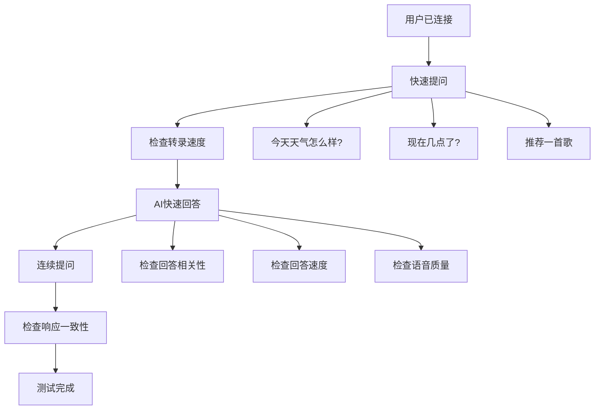

**测试步骤**：
1. 建立正常连接
2. 快速提问："今天天气怎么样？"
3. 记录从说话结束到听到回复的时间
4. 继续提问："现在几点了？"
5. 再次提问："推荐一首歌"
6. 检查每次回答的相关性和准确性

**预期结果**：
- 每次回答延迟 < 2秒
- 回答内容相关且准确
- 语音质量保持一致
- 无明显卡顿或中断

#### 场景3：长对话上下文理解
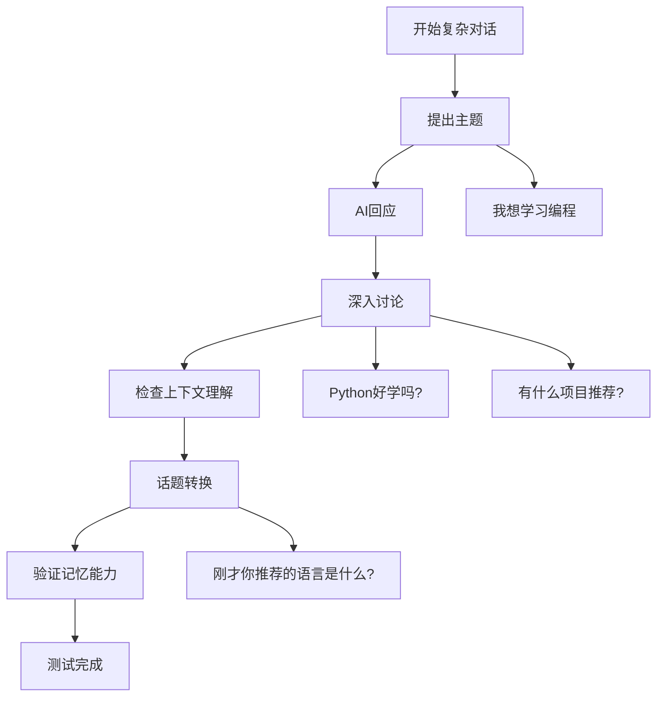

**测试步骤**：
1. 说话："我想学习编程，你有什么建议吗？"
2. 听取AI回答
3. 继续："Python好学吗？"
4. 再问："有什么项目推荐？"
5. 测试记忆："刚才你推荐的语言是什么？"
6. 检查AI是否能正确引用之前的对话内容

**预期结果**：
- AI能理解对话上下文
- 回答具有连贯性
- 能正确引用之前的信息
- 话题转换自然流畅

---

## 🔧 功能模块测试用例

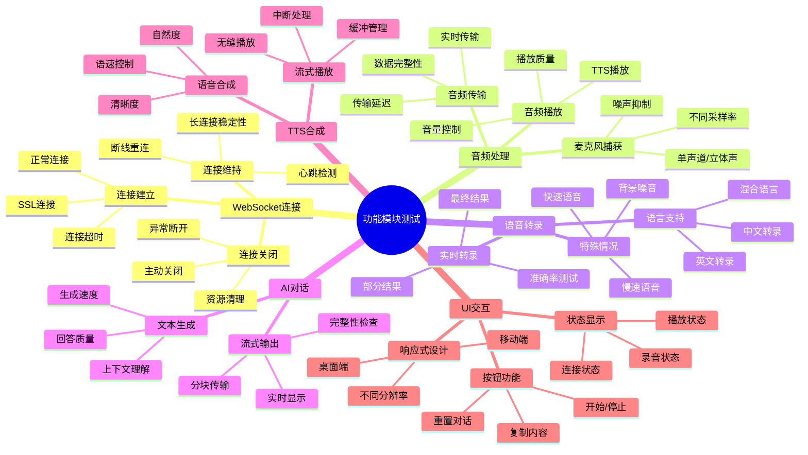

### 详细功能测试用例

#### WebSocket连接测试
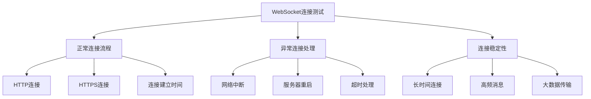

**测试用例WS-001：正常连接建立**
- **前置条件**：服务器正常运行，网络连接正常
- **测试步骤**：
  1. 打开应用页面
  2. 点击"开始"按钮
  3. 观察连接状态变化
- **预期结果**：
  - 连接在2秒内建立成功
  - 状态显示"Connected. Activating mic and TTS…"
  - WebSocket状态为OPEN

**测试用例WS-002：连接中断恢复**
- **前置条件**：已建立正常连接
- **测试步骤**：
  1. 断开网络连接5秒
  2. 恢复网络连接
  3. 观察应用行为
- **预期结果**：
  - 显示连接中断提示
  - 自动尝试重连
  - 连接恢复后功能正常

#### 音频处理测试
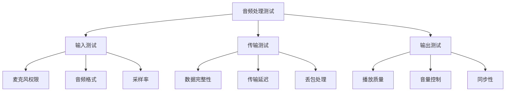

**测试用例AU-001：麦克风捕获**
- **前置条件**：浏览器支持WebRTC，有可用麦克风
- **测试步骤**：
  1. 授权麦克风权限
  2. 说话测试
  3. 检查音频数据传输
- **预期结果**：
  - 权限正常获取
  - 音频数据实时传输
  - 采样率为24kHz，单声道

**测试用例AU-002：TTS播放质量**
- **前置条件**：已建立连接，AI正在回答
- **测试步骤**：
  1. 触发AI回答
  2. 检查音频播放
  3. 测试不同长度的回答
- **预期结果**：
  - 语音清晰自然
  - 无明显卡顿
  - 音量适中

---

## ⚠️ 异常场景测试用例

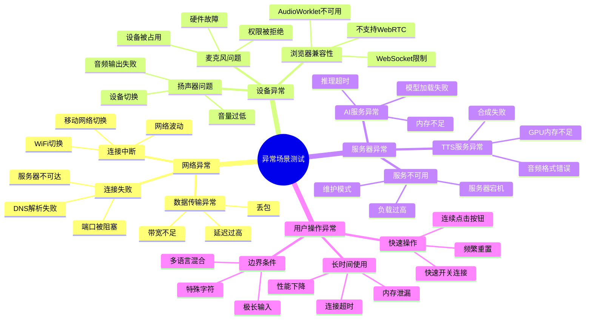

### 详细异常测试用例

#### 网络异常测试
**测试用例EX-001：网络连接中断**
- **测试步骤**：
  1. 建立正常连接
  2. 在对话过程中断开网络
  3. 观察应用反应
  4. 恢复网络连接
- **预期结果**：
  - 显示连接中断提示
  - 停止音频录制和播放
  - 网络恢复后可重新连接

**测试用例EX-002：服务器不可达**
- **测试步骤**：
  1. 停止服务器
  2. 尝试建立连接
  3. 观察错误处理
- **预期结果**：
  - 显示连接失败提示
  - 不会无限重试
  - 提供重试选项

#### 设备异常测试
**测试用例EX-003：麦克风权限被拒绝**
- **测试步骤**：
  1. 在权限提示中选择"拒绝"
  2. 观察应用行为
  3. 尝试重新获取权限
- **预期结果**：
  - 显示权限错误提示
  - 提供重新授权指导
  - 不会崩溃或卡死

**测试用例EX-004：音频设备切换**
- **测试步骤**：
  1. 建立正常连接
  2. 在使用过程中切换音频设备
  3. 测试功能是否正常
- **预期结果**：
  - 自动适应新设备
  - 音频质量保持稳定
  - 无需重新连接

---

## 🚀 性能测试用例

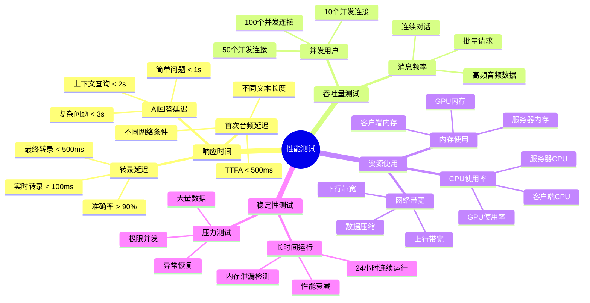

### 详细性能测试用例

#### 响应时间测试
**测试用例PF-001：首次音频延迟(TTFA)**
- **测试目标**：验证从用户说话结束到听到AI回复的时间
- **测试步骤**：
  1. 建立连接
  2. 说话："你好"
  3. 记录说话结束时间
  4. 记录听到回复开始时间
  5. 计算延迟时间
- **性能指标**：
  - 平均TTFA < 500ms
  - 95%分位数 < 1000ms
  - 99%分位数 < 2000ms

**测试用例PF-002：并发用户测试**
- **测试目标**：验证系统支持的最大并发用户数
- **测试步骤**：
  1. 逐步增加并发连接数
  2. 每个连接进行标准对话测试
  3. 监控系统资源使用
  4. 记录性能衰减点
- **性能指标**：
  - 支持至少50个并发用户
  - 响应时间增长 < 50%
  - 错误率 < 1%

#### 资源使用测试
**测试用例PF-003：内存使用监控**
- **测试目标**：检测内存泄漏和使用效率
- **测试步骤**：
  1. 记录初始内存使用
  2. 进行1小时连续对话
  3. 每10分钟记录内存使用
  4. 分析内存增长趋势
- **性能指标**：
  - 客户端内存增长 < 100MB/小时
  - 服务器内存增长 < 500MB/小时
  - 无明显内存泄漏

---

## 🌐 兼容性测试用例

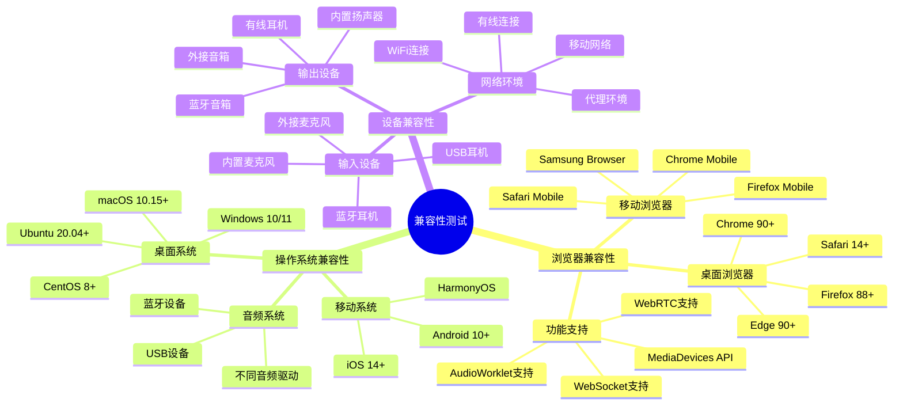

### 详细兼容性测试用例

#### 浏览器兼容性测试
**测试用例CP-001：主流浏览器测试**
- **测试范围**：Chrome、Firefox、Safari、Edge最新版本
- **测试步骤**：
  1. 在每个浏览器中打开应用
  2. 执行完整的功能测试
  3. 记录兼容性问题
- **验收标准**：
  - 所有核心功能正常工作
  - UI显示正确
  - 性能差异 < 20%

**测试用例CP-002：移动设备测试**
- **测试范围**：iOS Safari、Android Chrome
- **测试步骤**：
  1. 在移动设备上访问应用
  2. 测试触摸操作
  3. 测试横竖屏切换
  4. 测试后台切换
- **验收标准**：
  - 响应式布局正确
  - 触摸操作流畅
  - 后台切换不影响连接

---

## 📊 测试执行计划

### 测试优先级分类

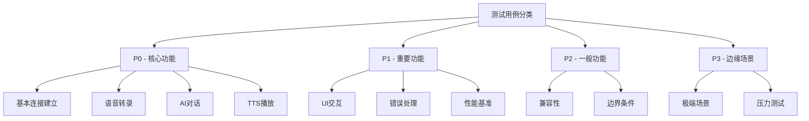

### 测试环境配置

| 环境类型 | 配置要求 | 用途 |
|---------|---------|------|
| 开发环境 | 本地开发机 | 功能验证、调试 |
| 测试环境 | 独立服务器 | 完整功能测试 |
| 性能环境 | 高配置服务器 | 性能和压力测试 |
| 生产环境 | 生产配置 | 上线前验证 |

### 测试数据准备

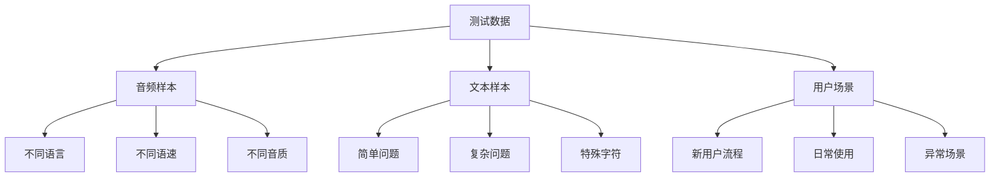

---

## 📋 测试用例总结

### 测试覆盖率目标

| 测试类型 | 用例数量 | 覆盖率目标 |
|---------|---------|-----------|
| 功能测试 | 45个 | 95% |
| 性能测试 | 15个 | 90% |
| 兼容性测试 | 20个 | 85% |
| 异常测试 | 25个 | 80% |
| **总计** | **105个** | **90%** |

### 关键质量指标

| 指标类型 | 目标值 | 测试方法 |
|---------|--------|---------|
| 功能正确性 | 99% | 自动化测试 |
| 性能响应时间 | TTFA < 500ms | 性能监控 |
| 系统稳定性 | 99.9% | 长时间运行 |
| 用户满意度 | > 4.5/5 | 用户调研 |

---

**文档版本**: v1.0  
**最后更新**: 2025年6月3日  
**状态**: 测试用例设计完成